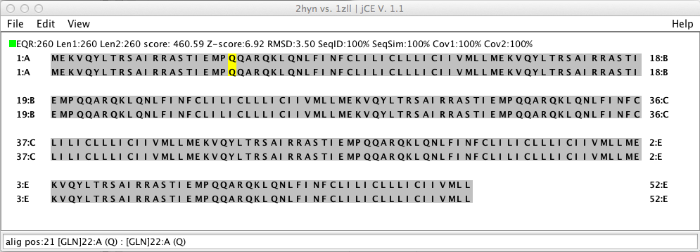
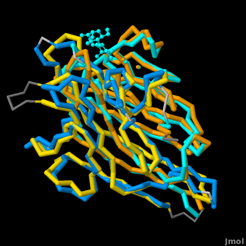

Protein Structure Alignment
===========================

## What is a structure alignment?

A **Structural alignment** attempts to establish equivalences between two or more polymer structures based on their shape and three-dimensional conformation. In contrast to simple structural superposition (see below), where at least some equivalent residues of the two structures are known, structural alignment requires no a priori knowledge of equivalent positions. 

Structural alignment is a valuable tool for the comparison of proteins with low sequence similarity, where evolutionary relationships between proteins cannot be easily detected by standard sequence alignment techniques. Structural alignment can therefore be used to imply evolutionary relationships between proteins that share very little common sequence. However, caution should be exercised when using the results as evidence for shared evolutionary ancestry, because of the possible confounding effects of convergent evolution by which multiple unrelated amino acid sequences converge on a common tertiary structure.

For more info see the Wikipedia article on [protein structure alignment](http://en.wikipedia.org/wiki/Structural_alignment).

## Alignment Algorithms supported by BioJava

BioJava comes with implementations of the Combinatorial Extension (CE) and FATCAT algorithms. Both algorithms come in two variations, as such one can say that BioJava supports the following four algorithms.

1. Combinatorial Extension (CE)
2. Combinatorial Extension with Circular Permutation (CE-CP)
3. FATCAT - rigid
4. FATCAT - flexible.

## Alignment User Interface

Before going the details how to use the algorithms programmatically, let's take a look at the user interface that cames with the *biojava-structure-gui* module.

<pre>
        AlignmentGui.getInstance();
</pre>    

shows the following user interface. 

You can manually select protein chains, domains, or custom files to be aligned. Try to align 2hyn vs. 1zll. This will show the results in a graphical way, in 3D:

and also a 2D display, that interacts with the 3D display

The functionality to perform and visualize these alignments can of course be used also from your own code. Let's first have a look at the alignment algorithms:

## The Alignment Algorithms

### Combinatorial Extension (CE)

The Combinatorial Extension (CE) algorithm was originally developed by
[Shindyalov and Bourne in
1998](http://peds.oxfordjournals.org/content/11/9/739.short).
It works by identifying segments of the two proteins with similar local
structure, and then combining those to try to align the most residues possible
while keeping the overall RMSD of the superposition low.

CE is a rigid-body alignment algorithm, which means that the structures being
compared are kept fixed during superpositon. In some cases it may be desirable
to break large proteins up into domains prior to aligning them (by manually
inputing a subrange, using the [SCOP or CATH databases](externaldb.md), or by
decomposing the protein automatically using the [Protein Domain
Parser](http://www.biojava.org/docs/api/org/biojava/bio/structure/domain/LocalProteinDomainParser.html)
algorithm).

### Combinatorial Extension with Circular Permutation (CE-CP)

CE and FATCAT both assume that aligned residues occur in the same order in both
proteins (e.g. they are both *sequence-order dependent* algorithms). In proteins
related by a circular permutation, the N-terminal part of one protein is related
to the C-terminal part of the other, and vice versa. CE-CP allows circularly
permuted proteins to be compared.  For more information on circular
permutations, see the
[wikipedia](http://en.wikipedia.org/wiki/Circular_permutation_in_proteins) or
[Molecule of the
Month](http://www.pdb.org/pdb/101/motm.do?momID=124&evtc=Suggest&evta=Moleculeof%20the%20Month&evtl=TopBar)
articles.

For proteins without a circular permutation, CE-CP results look very similar to
CE results (with perhaps some minor differences and a slightly longer
calculation time). If a circular permutation is found, the two halves of the
proteins will be shown in different colors:

CE-CP was developed by Spencer E. Bliven, Philip E. Bourne, and Andreas Prli&#263;.

### FATCAT - rigid

This is a Java implementation of the original FATCAT algorithm by [Yuzhen Ye
&amp; Adam Godzik in
2003](http://bioinformatics.oxfordjournals.org/content/19/suppl_2/ii246.abstract).
It performs similarly to CE for most proteins. The 'rigid' flavor uses a
rigid-body superposition and only considers alignments with matching sequence
order.

### FATCAT - flexible

FATCAT-flexible introduces 'twists' between different parts of the proteins
which are superimposed independently. This is ideal for proteins which undergo
large conformational shifts, where a global superposition cannot capture the
underlying similarity between domains. For instance, the structures of
calmodulin with and without calcium bound can be much better aligned with
FATCAT-flexible than with one of the rigid alignment algorithms. The downside of
this is that it can lead to additional false positives in unrelated structures.

## Acknowledgements

Thanks to P. Bourne, Yuzhen Ye and A. Godzik for granting permission to freely use and redistribute their algorithms.

<!--automatically generated footer-->

---

Navigation:
[Home](../README.md)
| [Book 3: The Protein Structure modules](README.md)
| Chapter 8 : Structure Alignments

Prev: [Chapter 7 : SEQRES and ATOM records](seqres.md)

Next: [Chapter 9 : Biological Assemblies](bioassembly.md)
